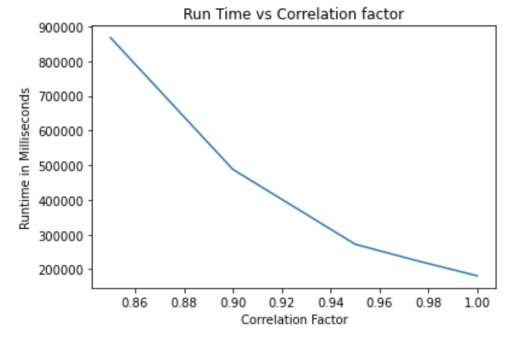
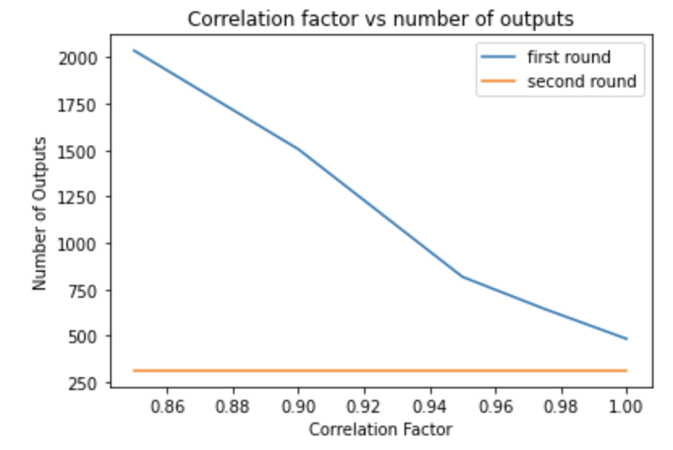

```{r setup, include=FALSE}
knitr::opts_chunk$set(   # This is for later! Don't worry about it now. 
  echo = FALSE,          # Don't show code.
  warning = FALSE,       # Don't show warnings.
  message = FALSE,       # Don't show messages (less serious warnings).
  fig.align = "center",  # Center figures.
  fig.width = 5,         # Size figures nicely by default
  fig.height = 3,        # Size figures nicely by default
  dev = "cairo_pdf",     # Enable this to use custom fonts
  singlespacing = TRUE   # Makes code single spaced and returns to 1.5
)
```

The runtime decreases as the correction factor increases, because the minimum support for the first round increases.
Fewer itemsets are mined in the first round and therefore less time is spent processing the smaller number of candidate item sets.

When the "correction" factor increases, the algorithm takes a much shorter time to run. The graph below
shows a negative association between runtime and correction factor. The smaller the corr_value the more time it takes. The relationship is not particularly linear.

```{r out.width='60%'}

```


The graph shows a negative association between the number of outputs and the correction factor for the first round output, and there is a somewhat linear relationship between the second round output and the correction factor. There are more
outputs in the first round than the second. This makes sense because the correction factor lowers the minimum support allowing for more item sets to be mined. In the second round the correction factor does not affect the item sets mined since the minimum support remains constant.


```{r out.width='60%'}

```